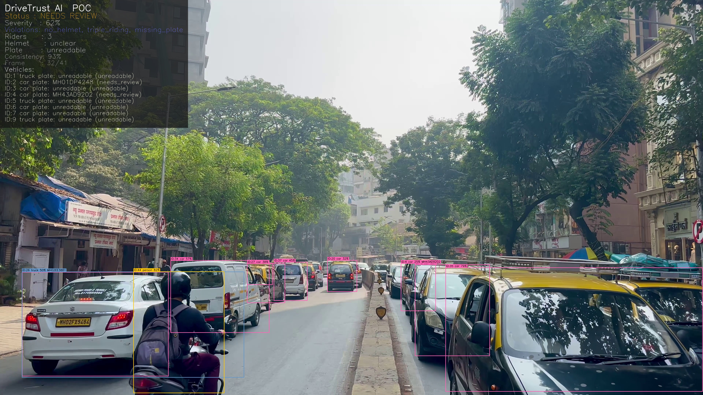
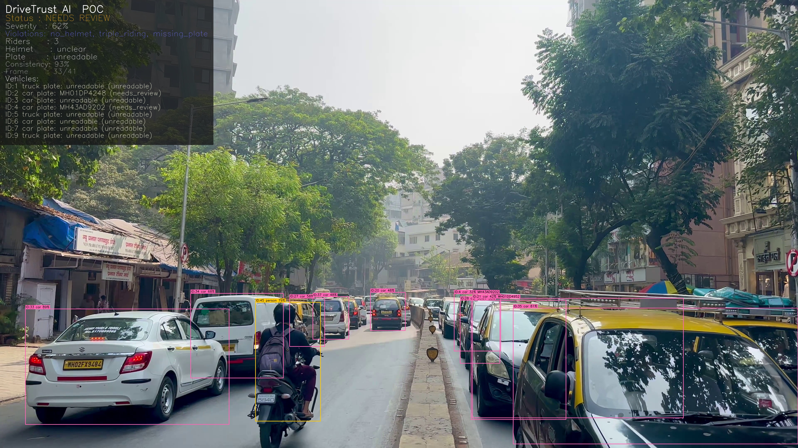
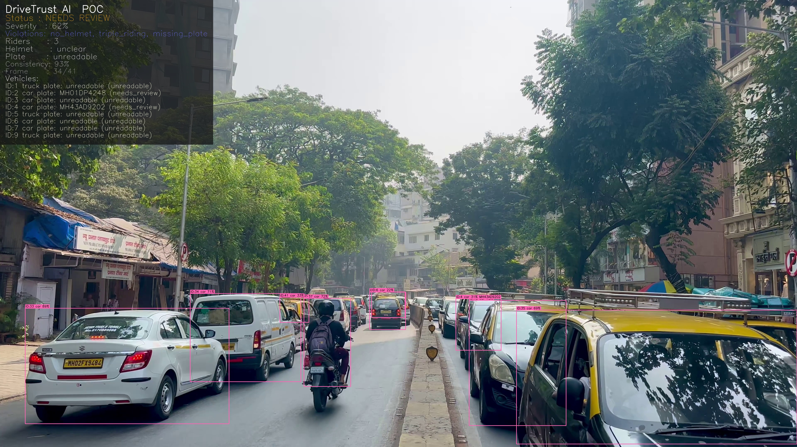

# RakshaRide — Distributed AI Traffic Intelligence Network (v2)

[](tests/)
[](https://www.python.org/)
[](https://github.com/ultralytics/ultralytics)
[](https://github.com/ifzhang/ByteTrack)
[](pipeline/ocr.py)

> **Automated, track-centric traffic violation intelligence and advisory system.**  
> Processes traffic/dashcam footage, assigns persistent vehicle track IDs, accumulates multi-frame observations across 4 independent neural models, and resolves verdicts with evidence frames, annotated videos, and license plate recognition.  
> *Advisory only — designed to assist human enforcement review.*

---

## 🎬 Evidence & Video Showcase

The pipeline produces annotated video evidence, high-resolution flagged frame crops, and vehicle-level incident audit logs.

### 📹 Annotated Evidence Video
- **[▶ View / Download Annotated Evidence Video (`evidence/evidence_video.mp4`)](evidence/evidence_video.mp4)**  
*(Click the link above to view or download the full video output on GitHub)*

### 📸 Flagged Evidence Frames
| Frame @ 15.5s | Frame @ 16.0s | Frame @ 16.5s |
| :---: | :---: | :---: |
|  |  |  |

---

## 🌟 Key Architecture & Capabilities

1. **4 Independent Model Stages:**
   - **`yolov8n.pt`**: Multi-class detection (`person`, `motorcycle`, `car`, `bus`, `truck`, `traffic light`, `cell phone`).
   - **`helmet_model.pt`**: Dedicated classifier for `helmet` vs `no helmet`.
   - **`ampr.pt`**: High-precision license plate localizer.
   - **`classifiacation.pt`**: Fine-grained vehicle classifier (`Bus`, `Car`, `Mini LCV`, `Truck 3/4/5-axle`).

2. **Track-Centric Evidence Brain (`VehicleStateRegistry`):**
   - Each vehicle receives a persistent ID via **ByteTrack**.
   - Violations (`no_helmet`, `triple_riding`, `phone_usage`, `wheelie`, `erratic_driving`, `signal_violation`) accumulate across the clip per vehicle ID.
   - Verdicts are confirmed via **minimum evidence count** and **agreement ratio**, not single-frame glitches.

3. **Two-Wheeler Gating (`VehicleClassGate`):**
   - Hard guard clause preventing false positives: non-two-wheelers (cars, buses, trucks) can never receive helmet, triple-riding, or wheelie violations.

4. **Multi-Frame ANPR Engine:**
   - **Zoom-then-read** (`plate_crop_enhancer.py`): 15% crop padding and 128px upscaling before OCR.
   - **3-Tier Escalation**: EasyOCR (fast local) → PaddleOCR (structured fallback) → Gemini Vision VLM (ambiguity breaker).
   - **Positional Consensus**: Character-position majority voting recovers plates missed by individual frames.
   - **Indian State-Code Whitelist**: Filters out impossible state codes (e.g., `HH` vs `MH`).

5. **Car Track Merger (`TrackMerger`):**
   - Re-links fragmented car tracks across camera occlusions using Levenshtein plate similarity ($\le 2$) and temporal compatibility.

---

## 📂 Project Structure

```text
RakshaRide/
├── evidence/                            # Curated evidence showcase (video & frames)
│   ├── evidence_video.mp4               # Full annotated video with bounding boxes & tags
│   ├── evidence_t15.500s.jpg            # Flagged evidence frame
│   ├── evidence_t16.000s.jpg
│   ├── evidence_t16.500s.jpg
│   ├── report.json                      # Sample JSON violation output
│   └── track_log.json                   # Vehicle tracking audit log
├── new ai pipeline/                     # Production AI Pipeline
│   ├── pipeline/
│   │   ├── frame_extractor.py           # Video frame sampling
│   │   ├── detector.py                  # Multi-model inference coordinator
│   │   ├── tracker.py                   # ByteTrack Kalman filter tracking
│   │   ├── vehicle_state.py             # VehicleState & VehicleStateRegistry
│   │   ├── vehicle_class_gate.py        # Strict two-wheeler guard clauses
│   │   ├── vehicle_class_aggregator.py  # Multi-frame vehicle voting with flip-flop detection
│   │   ├── track_merger.py              # Car track fragment merger via Levenshtein
│   │   ├── plate_crop_enhancer.py       # Zoom-then-read padding & upscaling
│   │   ├── indian_plate_validator.py    # 36 Indian state/UT code whitelist
│   │   ├── plate_aggregator.py          # 3-tier OCR escalation & positional consensus
│   │   ├── ocr.py                       # EasyOCR / PaddleOCR text extraction
│   │   ├── rules.py                     # Rule engine (helmet, riders, phone, lights)
│   │   ├── heuristics.py                # Wheelie & erratic driving heuristics
│   │   ├── verification.py              # Clip-level consistency scoring
│   │   ├── report.py                    # Output report generator (vehicles_v2)
│   │   ├── annotator.py                 # Evidence overlay and video renderer
│   │   ├── feedback_layer.py            # Human review audit logging
│   │   └── vlm.py                       # Gemini / NVIDIA VLM validators
│   ├── models/                          # Trained weights (.pt via Git LFS)
│   │   ├── yolov8n.pt                   # COCO base detector
│   │   ├── helmet_model.pt              # Custom helmet detector
│   │   ├── ampr.pt                      # Custom license plate detector
│   │   └── classifiacation.pt           # Custom vehicle classification
│   ├── api/
│   │   └── main.py                      # FastAPI REST service (/analyze, /health)
│   ├── tests/                           # 84 automated unit tests
│   │   ├── test_track_network.py        # Vehicle state, gating, merging tests
│   │   ├── test_pipeline.py             # Rule engine synthetic tests
│   │   ├── test_plate_aggregator.py     # Multi-frame OCR consensus tests
│   │   ├── test_tracker.py              # Tracking tests
│   │   └── sample_videos/               # Sample test video clips
│   ├── requirements.txt                 # Python dependencies
│   └── run_pipeline.py                  # CLI pipeline runner
├── docs/
│   └── master_build_spec.md             # Authoritative architecture spec
├── .gitattributes                       # Git LFS rules for weights & videos
├── .gitignore
└── README.md
```

---

## 🚀 Quickstart

### 1. Environment Setup
```powershell
# Clone the repository
git clone https://github.com/Prathameshdahe/Raksharider.git
cd Raksharider

# Navigate to pipeline directory
cd "new ai pipeline"

# Create virtual environment
python -m venv .venv
.venv\Scripts\Activate.ps1   # On Windows
# source .venv/bin/activate  # On Linux/macOS

# Install dependencies
pip install -r requirements.txt
```

### 2. Run the Pipeline on Video
```powershell
# Run with tracking enabled
python run_pipeline.py tests/sample_videos/sample.mp4 --track

# Run with custom sampling interval and output folder
python run_pipeline.py tests/sample_videos/sample.mp4 --interval 0.5 --out pipeline/evidence_output/my_run --track

# Run with VLM escalation enabled
python run_pipeline.py tests/sample_videos/sample.mp4 --track --vlm
```

### 3. Run Automated Tests
```powershell
python -m pytest tests/ -v
# 84 passed in ~0.86s
```

---

## 📊 Sample Output Report (`report.json`)

```json
{
  "_disclaimer": "Automated advisory for human review. Not a final enforcement decision.",
  "run_id": "7b8c2d11",
  "generated_at": "2026-09-05T07:15:00Z",
  "status": "auto_flagged",
  "severity_score": 0.88,
  "dominant_vehicle_type": "motorcycle",
  "summary": {
    "total_vehicles_tracked": 3,
    "vehicles_with_violations": 1,
    "vehicles_clean": 2
  },
  "all_tracked_vehicles": [
    {
      "track_id": 1,
      "class": "motorcycle",
      "first_seen": 15.0,
      "last_seen": 17.5,
      "violations": ["no_helmet"]
    }
  ],
  "vehicles_v2": [
    {
      "track_id": 1,
      "vehicle_class": "motorcycle",
      "class_confidence": 0.95,
      "plate": {
        "text": "MH01DP1218",
        "confidence": 0.88,
        "needs_review": false
      },
      "confirmed_violations": ["no_helmet"],
      "violations": {
        "no_helmet": {
          "result": "confirmed",
          "evidence_frames": 4,
          "agreement": 0.80,
          "confidence": 0.89,
          "reasoning": "Confirmed: 4/5 frames positive (agreement 80%, mean_conf 0.89)."
        }
      }
    }
  ]
}
```

---

## ⚖️ Advisory Notice
*DriveTrust AI / RakshaRide outputs are designed as decision support systems for municipal and traffic authorities. Generated alerts and violation records flag footage for human officer validation and review.*
